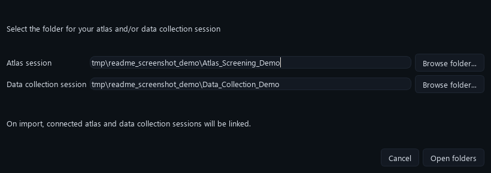
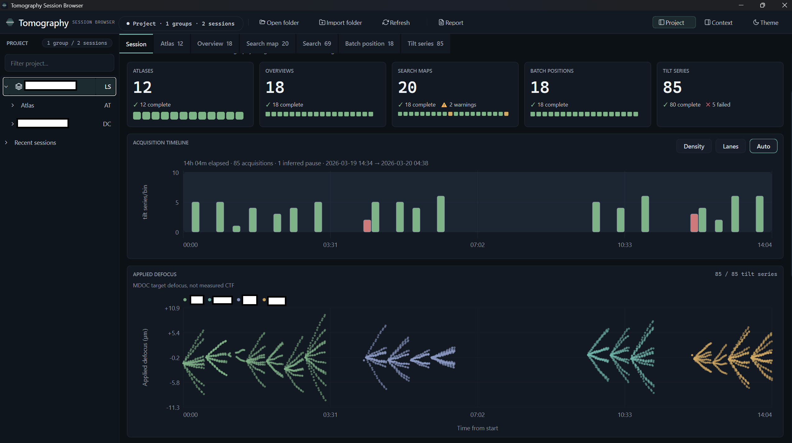
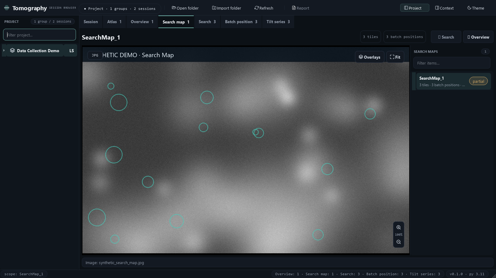
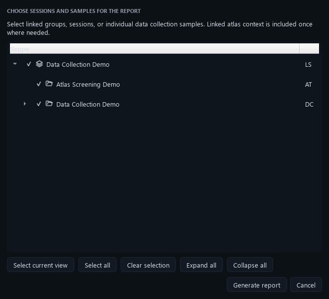

# Tomography Session Browser

Tomography Session Browser is a desktop application for reviewing **Thermo Fisher Tomography 5** session folders. It brings atlas screening and data collection sessions into one workspace, shows acquisition images and metadata, highlights incomplete or failed tilt series, and exports scoped PDF reports.

The application is **read-only**. It does not edit, repair, rename, move, or normalise files in your microscope output folders.

## Platform support

The application runs on:

| Operating system | Recommended terminal |
|---|---|
| Windows | PowerShell, Miniforge Prompt, or Anaconda Prompt |
| Linux | Bash |
| macOS (formerly OS X) | Terminal using Zsh or Bash |

Python and the application dependencies are installed in an isolated Conda environment, so you do not need to change your system Python.

## Before you begin

You need:

- A 64-bit Windows, Linux, or macOS computer with a graphical desktop.
- [Git](https://git-scm.com/downloads), unless you download the repository as a ZIP file.
- A Conda-compatible installer. [Miniforge, Miniconda, and Anaconda installation options are described in the official Conda guide](https://docs.conda.io/projects/conda/en/stable/user-guide/install/).
- An original Thermo Fisher Tomography 5 atlas screening or data collection session folder.

If you are new to Conda, install it, close and reopen your terminal, and confirm that this command works:

```text
conda --version
```

## Install and launch

### Windows PowerShell

On the repository page, select **Code**, copy the HTTPS URL, open PowerShell, and run:

```powershell
git clone PASTE_REPOSITORY_URL_HERE
Set-Location Tomography_5_session_viewer
conda env create -f environment.yml
conda activate tomoapp_session
python -m pip install -e .
tomo_session_viewer
```

### Linux Bash

On the repository page, select **Code**, copy the HTTPS URL, open a terminal, and run:

```bash
git clone PASTE_REPOSITORY_URL_HERE
cd Tomography_5_session_viewer
conda env create -f environment.yml
conda activate tomoapp_session
python -m pip install -e .
tomo_session_viewer
```

### macOS Terminal

On the repository page, select **Code** and copy the HTTPS URL. These commands work in the default Zsh shell and in Bash:

```bash
git clone PASTE_REPOSITORY_URL_HERE
cd Tomography_5_session_viewer
conda env create -f environment.yml
conda activate tomoapp_session
python -m pip install -e .
tomo_session_viewer
```

If you downloaded a ZIP instead of using Git, extract it, open a terminal in the extracted folder containing `environment.yml`, and begin with `conda env create -f environment.yml`.

The alternative launch command is:

```text
python -m tomography_session_browser.main
```

## Keep the original Tomography 5 folder structure

> [!IMPORTANT]
> Select a **whole session folder**, not an individual `.dm`, `.mrc`, `.mdoc`, XML, image, `Atlas`, `Batch`, `SearchMap_*`, or `Sample1` subfolder. Do not rename files or folders, change capitalisation, flatten the directory tree, or move individual files out of it. Copying a complete session for review is fine as long as everything inside the copied session remains unchanged.

The application recognises original Tomography 5 names and uses recorded paths to link atlas and data collection sessions. Renaming or rearranging them can cause missing images, empty tabs, or unresolved atlas links. Exact capitalisation is particularly important on Linux and on case-sensitive macOS filesystems.

### Typical atlas screening session

The folder selected in the **Atlas session** field is the top folder containing `ScreeningSession.dm`:

```text
Atlas_Screening_Session/          <- select this folder
├── ScreeningSession.dm
├── Sample1/                      <- Sample1 or Sample-1 style names
│   ├── Sample.dm
│   └── Atlas/
│       ├── Atlas.dm
│       ├── Atlas_*.mrc or Atlas_*.jpg
│       └── Tile_* files
└── ...other original Tomography 5 files
```

### Typical multi-grid data collection session

The folder selected in the **Data collection session** field is the top folder containing `Session.dm` and the original sample folders:

```text
Data_Collection_Session/          <- select this folder
├── Session.dm
├── Sample1/
│   ├── Session.dm
│   ├── SearchMaps/
│   │   └── SearchMap_*/
│   │       ├── SearchMap.mrc or SearchMap.jpg
│   │       ├── Overview.mrc or Overview.jpg
│   │       └── Tile_* files
│   ├── Batch/
│   │   ├── BatchPositionsList.xml
│   │   └── *_Search.mrc, *_Tracking.mrc, and *_Exposure.mrc
│   └── matching tilt-series `.mrc` and `.mdoc` files
├── Sample2/
└── ...other original Tomography 5 files
```

Single-collection exports can place `Session.dm`, `SearchMaps`, `Batch`, and matching tilt-series files directly in their top-level session folder. Select that original top-level folder.

The examples above show the names used for discovery; real sessions may contain more files and may be incomplete. The browser tries to load partial sessions and reports recoverable problems as warnings.

## First review: step by step

All screenshots below were generated by the real application using **synthetic dummy data**. They contain no microscope or research data.

### 1. Open one or two session folders

Launch the application and select **Open folder**. You may provide an atlas screening session, a data collection session, or both. Use **Browse folder...** and choose each whole session folder. When both are supplied, the application links them only when the recorded metadata supports the relationship.



If you later need to add another related session, use **Import folder**. Imported folders are also read-only.

### 2. Check the project tree and Session dashboard

After loading finishes, the left project tree shows the available project scope and the Session tab summarises atlases, overviews, search maps, batch positions, tilt series, acquisition timing, and warnings.



Project badges mean:

| Badge | Meaning |
|---|---|
| `LS` | Linked atlas and data collection session |
| `AT` | Atlas-only session |
| `DC` | Data collection session |
| `!` | Atlas link is unresolved or ambiguous; inspect the warning instead of assuming a link |

### 3. Review images, status, metadata, and links

Use the **Atlas**, **Overview**, **Search map**, **Search**, **Batch position**, and **Tilt series** tabs. Select an item from the list to inspect its image, overlays, status, metadata, and available cross-tab navigation. Counts in the tab titles follow the selected project, session, or sample scope.



Warnings and failed or incomplete status labels are expected when source data or links are missing. The browser shows unresolved information rather than inventing a scientific relationship.

### 4. Generate a scoped PDF report

Select **Report**, choose the linked group, session, or individual data collection samples to include, and then select **Generate report**. Supporting atlas context is included once where required.



## Updating an existing installation

Open a terminal in the repository folder and run:

```text
git pull
conda env update -n tomoapp_session -f environment.yml --prune
conda activate tomoapp_session
python -m pip install -e .
```

If you installed from a ZIP, download and extract the new version, then run the last three commands from the new folder.

## Troubleshooting

### `conda` is not recognised or says `command not found`

Close and reopen the terminal after installing Conda. On Windows, try the Miniforge Prompt or Anaconda Prompt. On Linux or macOS, initialise the shell once and then reopen it:

```text
conda init
```

### The environment already exists

Update it instead of creating it again:

```text
conda env update -n tomoapp_session -f environment.yml --prune
conda activate tomoapp_session
python -m pip install -e .
```

### `tomo_session_viewer` is not recognised

Make sure the environment is active, then reinstall the entry point from the repository root:

```text
conda activate tomoapp_session
python -m pip install -e .
python -m tomography_session_browser.main
```

### The folder is rejected or the tabs are empty

- Confirm that you selected the whole session folder, not `Session.dm`, `ScreeningSession.dm`, `Atlas`, `Batch`, `SearchMaps`, `SearchMap_*`, or a single MRC file.
- Confirm that original names, capitalisation, and folder nesting have not changed.
- For atlas screening, confirm the selected root contains `ScreeningSession.dm`.
- For multi-grid data collection, confirm the selected root contains `Session.dm` and `Sample1` or `Sample-1` style folders.
- Read any warning shown by the application. Partial acquisition data may load with missing previews or unresolved links.

### Linux reports a Qt platform plugin error

The application needs a graphical desktop session. Run it from a desktop terminal rather than a headless SSH session. Linux desktop library names vary by distribution; use your distribution's Qt/PySide guidance if the error identifies a missing system library.

### Settings cannot be saved

The application may log a warning if the user configuration directory is read-only. Session browsing and report generation can still work because source tomography folders are never used for settings storage.

## Advanced and developer use

The project uses Python 3.11, PySide6, Pillow, NumPy, ReportLab, and pytest. Editable installation keeps the launch command connected to the current working copy:

```text
conda env create -f environment.yml
conda activate tomoapp_session
python -m pip install -e .
```

Run the complete test suite:

```text
conda run -n tomoapp_session python -m pytest --basetemp .pytest_tmp
```

Run a syntax/import compile check:

```text
conda run -n tomoapp_session python -m compileall tomography_session_browser tests tools
```

Regenerate the public README screenshots from synthetic data:

```text
conda run -n tomoapp_session python tools/generate_readme_screenshots.py
```

For UI or report changes, also launch the application, open a known non-sensitive session, inspect the affected scopes and tabs, and generate a scoped PDF where practical. Never commit microscope session data or screenshots containing sensitive project data.

## Scope and data safety

- Designed for Thermo Fisher Tomography 5 session layouts.
- Reviews acquisition metadata and imagery; it is not a reconstruction pipeline.
- Keeps parsed models and project grouping in memory.
- Does not repair or write back to source session folders.
- Preserves ambiguous or missing scientific associations as warnings instead of guessing.

## License

This project is available under the [MIT License](LICENSE). You may use, copy,
modify, merge, publish, distribute, sublicense, or sell copies of the software,
provided that the copyright and permission notice remain with copies or
substantial portions of the software.
